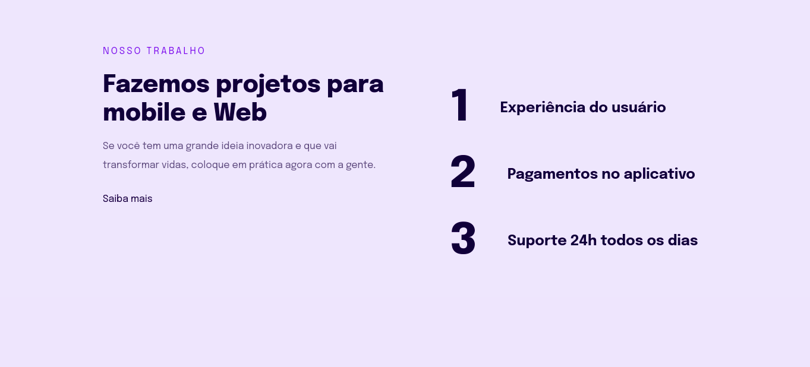

  

## 🚀 Tecnologias

Esse projeto foi desenvolvido com as seguintes tecnologias:

- [HTML](https://developer.mozilla.org/pt-BR/docs/Web/HTML)
- [CSS](https://developer.mozilla.org/pt-BR/docs/Web/CSS)

## 💻 Projeto

O projeto Rocket.project é site sobre criação de projetos, ele foi elaborado na aula do Stage03 no programa Explorer da Rocketseat.

- [Página](https://leokazuyukinagatani.github.io/rocket-project//)

## 🔖 Layout

No link abaixo você encontra o layout do projeto web. Lembrando que você precisa ter uma conta no [Figma](http://figma.com/) para acessá-lo.

- [Layout Web](https://www.figma.com/file/wkzfsboHLP412fnRLlZo5D/Explorer-Stage-03-Projeto-02-(Copy)?node-id=203%3A412)

